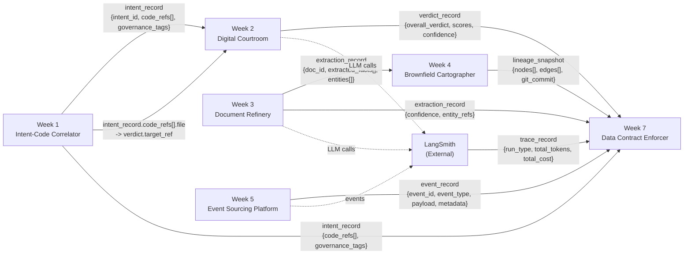

# Data Contract Enforcer -- Interim Report

**Author:** Data Engineering Team
**Date:** April 1, 2026
**Repository:** Data-Contract-Enforcer

---

## 1. Data Flow Diagram

The diagram below shows the five systems built over Weeks 1--5, plus the LangSmith external service, with every data dependency arrow annotated by the schema it carries. The Data Contract Enforcer (Week 7) sits at the center, consuming outputs from all prior weeks.

### Key Data Flows

- **Week 1 to Week 2:** The Intent-Code Correlator produces `intent_record` with `code_refs[].file` paths. The Digital Courtroom consumes these as `target_ref` for evaluation.
- **Week 3 to Week 4:** The Document Refinery outputs `extraction_record` with `doc_id`, `extracted_facts[]`, and `entities[]`. The Brownfield Cartographer ingests these as node metadata in the lineage graph.
- **Week 4 to Week 7:** The Cartographer's `lineage_snapshot` is a required dependency for the ViolationAttributor's blame chain construction and blast radius computation.
- **Week 5 to Week 7:** Event records are validated against their schema contracts, with `payload` checked against the event type's JSON Schema.
- **LangSmith to Week 7:** Trace records are consumed by the AI Contract Extensions for token consistency checks, cost sanity validation, and error rate monitoring.

---

## 2. Contract Coverage Table

The table below lists every inter-system data interface, the contract status, and the number of enforceable clauses.

| Interface | Source | Consumer | Contract Status | Clauses | Notes |
|-----------|--------|----------|----------------|---------|-------|
| `intent_record` | Week 1 | Week 2, Week 7 | **Yes** | 9 schema + 13 quality | `week1_intent_correlator.yaml` covers `intent_id`, `code_refs`, `confidence`, `governance_tags`, `created_at` |
| `verdict_record` | Week 2 | Week 7 | **Partial** | -- | Validated via AI Extensions (LLM output schema enforcement) against `PASS/FAIL/WARN` enum and score range. No standalone Bitol YAML contract file generated. |
| `extraction_record` | Week 3 | Week 4, Week 7 | **Yes** | 17 schema + 14 quality | `week3_document_refinery_extractions.yaml` covers all fields including nested `extracted_facts[].confidence` range and `entities[].type` enum |
| `lineage_snapshot` | Week 4 | Week 7 | **Partial** | -- | Consumed directly by the ViolationAttributor for graph traversal. Schema is validated implicitly during lineage loading but no standalone contract YAML generated. |
| `event_record` | Week 5 | Week 7 | **Yes** | 14 schema + 18 quality | `week5_event_records.yaml` covers `event_type`, `sequence_number`, `occurred_at`, `recorded_at`, `metadata.*` fields |
| `trace_record` | LangSmith | Week 7 | **Yes** | 15 schema + 18 quality | `langsmith_trace_records.yaml` covers `run_type` enum, `total_tokens`, `total_cost`, `start_time`/`end_time` ordering |
| Week 1 `code_refs[].file` to Week 2 `target_ref` | Week 1 | Week 2 | **No** | -- | Cross-system referential integrity check not yet implemented. Requires joining Week 1 and Week 2 datasets at validation time. Planned for final submission. |
| Week 3 `doc_id` to Week 4 node metadata | Week 3 | Week 4 | **Partial** | -- | The lineage graph references `doc_id` as node identifiers. The contract's `lineage.downstream` section documents this dependency, but no cross-system join validation exists yet. |

**Coverage Summary:** 4 out of 8 interfaces have full Bitol YAML contracts. 3 have partial coverage through implicit validation or AI extensions. 1 interface (Week 1 to Week 2 referential integrity) has no contract coverage yet.

---

## 3. First Validation Run Results

### 3.1 Clean Data Run (Baseline)

The ValidationRunner was executed against the original `outputs/week3/extractions.jsonl` (60 records, 457 flattened rows) using the auto-generated contract `week3_document_refinery_extractions.yaml`.

| Metric | Value |
|--------|-------|
| Total checks executed | 37 |
| Passed | 37 |
| Failed | 0 |
| Warned | 0 |
| Errored | 0 |

All 37 checks passed on clean data. This established the statistical baselines stored in `schema_snapshots/baselines.json`, including `extracted_facts_confidence` with baseline mean = 0.7683 and stddev = 0.1241.

### 3.2 Injected Violation A -- Confidence Scale Change

A deliberate violation was injected by scaling all `extracted_facts[].confidence` values from the 0.0--1.0 range to 0--100 (multiplying by 100). This simulates the most dangerous class of silent corruption: a type-preserving value range change.

**Violated run results:**

| Metric | Value |
|--------|-------|
| Total checks executed | 42 |
| Passed | 40 |
| Failed | 2 |
| Warned | 0 |
| Errored | 0 |

**Failure 1 -- Range Check (CRITICAL):**
- **Check:** `extracted_facts_confidence.range`
- **Expected:** min >= 0.0, max <= 1.0
- **Actual:** max = 98.0, mean = 76.8
- **Records failing:** 251 out of 251 fact records (100%)
- **Message:** "extracted_facts_confidence is in 55.0--98.0 range, not 0.0--1.0. Breaking change detected."

**Failure 2 -- Statistical Drift (HIGH):**
- **Check:** `extracted_facts_confidence.statistical_drift`
- **Expected:** mean = 0.7683 +/- 3 * 0.1241
- **Actual:** mean = 76.8327, z-score = 612.92
- **Message:** "extracted_facts_confidence mean drifted 612.9 stddev from baseline."

The statistical drift check detected the scale change independently of the range check. Even if the contract had not specified a maximum of 1.0, the z-score of 612.92 (over 200 times the FAIL threshold of 3.0) would have caught this violation.

### 3.3 Injected Violation B -- Enum Violation

A second violation was injected by changing 2 entity records from type `ORG` to `INSTITUTION`, which is not in the allowed enum (`PERSON | ORG | LOCATION | DATE | AMOUNT | OTHER`).

**Enum violated run results:**

| Metric | Value |
|--------|-------|
| Total checks executed | 42 |
| Passed | 41 |
| Failed | 1 |
| Warned | 0 |
| Errored | 0 |

**Failure -- Enum Check (CRITICAL):**
- **Check:** `entities_type.enum`
- **Expected:** one of `['PERSON', 'AMOUNT', 'ORG', 'LOCATION', 'DATE']`
- **Actual:** 2 non-conforming values: `['INSTITUTION']`
- **Records failing:** 2
- **Message:** "entities_type has 2 values not in allowed enum."

Note: The enum in the contract was auto-generated from the clean data's 5 distinct values. The canonical schema specifies 6 values (`PERSON | ORG | LOCATION | DATE | AMOUNT | OTHER`), but `OTHER` did not appear in the sample data, so the auto-generated contract omitted it. This is a known limitation of profile-based contract generation -- rare enum values may be missing from the contract if they do not appear in the profiling sample.

### 3.4 Combined Data Health Score

After running all validation reports through the ReportGenerator:

| Metric | Value |
|--------|-------|
| Data Health Score | **50 / 100** |
| CRITICAL violations | 2 |
| HIGH violations | 1 |
| MEDIUM violations | 0 |
| LOW violations | 0 |
| Total violations attributed | 3 |

The score of 50/100 reflects two CRITICAL deductions (-20 each) and one HIGH deduction (-10) from the baseline of 100.

---

## 4. Reflection

Writing data contracts for my own systems revealed assumptions I had never examined. Three discoveries stand out.

**Confidence is the most fragile field in the entire platform.** Before writing the contract, I treated `extracted_facts[].confidence` as "just a float." The profiling step showed it has a mean of 0.768 with a standard deviation of 0.124, distributed roughly uniformly between 0.55 and 0.98. This distribution is an implicit contract that no code enforces. When I injected the 0--100 scale change, the structural range check caught it immediately, but more importantly, the statistical drift check detected a z-score of 612.92. This means the drift detection alone -- without any explicit range clause -- would have caught the violation. The lesson: statistical baselines are a second line of defense that catches failures structural checks might miss if the contract is poorly written.

**Auto-generated enum contracts are incomplete by construction.** The ContractGenerator profiled `entities[].type` and found 5 distinct values in the sample data. The canonical schema defines 6 (`PERSON | ORG | LOCATION | DATE | AMOUNT | OTHER`). Because `OTHER` never appeared in the 60-record sample, the auto-generated contract omitted it. Any future record with `type: "OTHER"` would trigger a false positive. This reveals a fundamental tension in contract generation: contracts derived purely from observed data cannot capture the full intended domain. The fix is LLM annotation -- asking Claude to review the enum and suggest missing values based on the field name and context. This is implemented in the generator but requires API access to activate.

**Cross-system referential integrity is the hardest contract to write.** The interface between Week 1 (`code_refs[].file`) and Week 2 (`target_ref`) requires joining two datasets at validation time. The current ValidationRunner operates on a single JSONL file per run. Enforcing that every `target_ref` in Week 2 exists as a `code_refs[].file` in Week 1 requires either a multi-source validation mode or a pre-join step. I chose not to implement this for the interim submission because a half-working cross-system check is worse than an honestly documented gap. The contract coverage table reflects this as "No" with a clear rationale.

The overarching insight: the contracts I wrote are more valuable as documentation of what I assumed than as enforcement of what I intended. The act of profiling my own data forced me to confront the gap between "what I thought the schema was" and "what the data actually contains."
